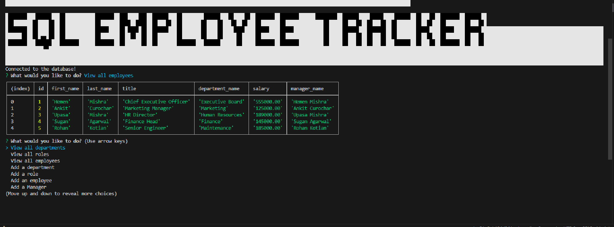
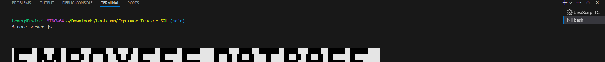

# Employee-Tracker-SQL
Content management systems

## Description:
SQL: 
The Employee Tracker is a database system designed to manage employee data for a fictional company. It provides a user-friendly interface that enables non-developers to access and manipulate information directly from the command line. All data is stored in a dedicated SQL Employee Tracker database, allowing for seamless interaction and organization.

## Table of Contents:
- [Overview](#Overview)
- [The Challenge](#The-Challenge)
- [Usage Information](#Usage-Information)
- [Installation Process](#Installation-Process)
- [Continued Development](#Continued-Development)


# Overview

## The Challenge:

Develop an interface to facilitate effortless access and interaction with data housed within an SQL Employee Tracker database, tailored for non-developers. Such interfaces, commonly referred to as Content Management Systems (CMS), aim to simplify data management tasks. The objective entails crafting a command-line application from the ground up to oversee a company's employee database, leveraging Node.js, Inquirer, and MySQL technologies. Upon completion, produce a walkthrough video showcasing the functionality and meeting the defined acceptance criteria, with the possibility of including additional bonus criteria.

## User Story
```md
AS A business owner
I WANT to be able to view and manage the departments, roles, and employees in my company
SO THAT I can organize and plan my business.
```

## Acceptance Criteria
```md
GIVEN a command-line application that accepts user input
WHEN I start the application
THEN I am presented with the following options: view all departments, view all roles, view all employees, add a department, add a role, add an employee, and update an employee role
WHEN I choose to view all departments
THEN I am presented with a formatted table showing department names and department ids
WHEN I choose to view all roles
THEN I am presented with the job title, role id, the department that role belongs to, and the salary for that role
WHEN I choose to view all employees
THEN I am presented with a formatted table showing employee data, including employee ids, first names, last names, job titles, departments, salaries, and managers that the employees report to
WHEN I choose to add a department
THEN I am prompted to enter the name of the department and that department is added to the database
WHEN I choose to add a role
THEN I am prompted to enter the name, salary, and department for the role and that role is added to the database
WHEN I choose to add an employee
THEN I am prompted to enter the employee’s first name, last name, role, and manager, and that employee is added to the database
WHEN I choose to update an employee role
THEN I am prompted to select an employee to update and their new role and this information is updated in the database 
```
## Image of Application.


## Usage Instructions

> Launch the content management system (CMS) titled "SQL Employee Database Tracker"
> Access the 'Integrated Terminal' and execute 'node server.js' within the 'server.js' file.
> Utilize the 'UP' and 'DOWN' arrow keys for navigation within the command line interface.
> Press the 'enter' or 'return' key to confirm your selection.
> Adhere to all command line prompts provided until reaching the desired option.


## Screenshots.
### Figure 1. Command line interface


## Installation Process

Install the following: 
- Inquirer.js: 
- MySQL2: 
- Console.table


### Continued Development:
1. Implement a 'History' functionality to track the dates of employee 'Additions' and 'Removals'.
2. Refine file and folder arrangement by establishing multiple subfolders for the server.js file to enhance organization and segregate additional Inquirer features.


## Repository Link:

https://github.com/hementB2/Employee-Tracker-SQL

## Walkthrough Video:
https://drive.google.com/file/d/14TmiBOwfAq4JDVkSVwTuGCTYIppPFNcC/view